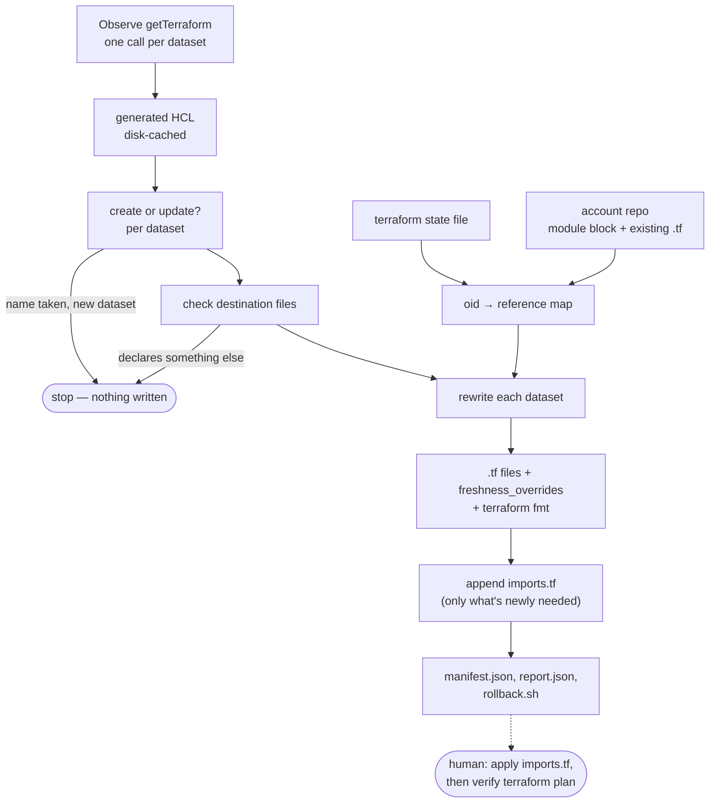

# tf-dataset-import

Generates repo-conventional terraform for a dataset that already exists in an Observe tenant, and
the config-driven import blocks that bring it into a terraform account repo's state.

The problem it solves: an account repo like `tf-account-example` manages hundreds of datasets
as code, but datasets created through the UI are invisible to it. Adopting one by hand means
transcribing its definition into HCL, replacing every tenant-specific object id with a portable
reference, matching the repo's conventions, and importing it into state without provoking a
rematerialization of production data. This does that for an arbitrary list of datasets — and a
dataset already under management is not skipped, but updated: its file is regenerated from the
dataset's current live definition, so running this again for the same id is how a dataset that
changed in Observe stays in sync in Terraform, and running it again with nothing changed is a
genuine no-op.

The tool never touches a terraform backend. It reads the Observe API and local files, and writes
`.tf` files plus `imports.tf` and a rollback script. Performing the import (`terraform apply`) is a
separate, deliberate step.

## Usage

```bash
go build -o tf-dataset-import .

./tf-dataset-import \
  -dataset-ids 99039057,99039058 \
  -profile my-profile \
  -repo ~/tf-account-example \
  -module-dir modules/example \
  -state ~/tfstate.json \
  -out ./out
```

| Flag | Purpose |
| --- | --- |
| `-dataset-ids`, `-dataset-ids-file` | Datasets to process. The file form takes one id per line and allows `#` comments. |
| `-profile` | Profile in `~/.observe/config.json` supplying customer id, domain and token. |
| `-customer-id`, `-domain`, `-token` | Credentials given directly; each overrides `-profile`. `OBSERVE_TOKEN` is also read. |
| `-repo`, `-module-dir` | The account repo and the module directory to write into. |
| `-state` | Source tenant state file (`terraform state pull`'s output, not a local backend file — see [State acquisition](#state-acquisition)), where an already-managed dataset and every reference are resolved from. |
| `-target-state` | Optional replica state, checked for dataset-name collisions on newly-created datasets. |
| `-tf-workspace` | Optional workspace name baked into `rollback.sh`'s workspace guard, for running it by hand. |
| `-name-overrides` | JSON mapping dataset id to terraform resource name, for settling collisions. |
| `-adopt-freshness-default` | Emit an active freshness lookup where a dataset has none, instead of a commented-out one. See [Freshness](#freshness). |
| `-import-gate` | HCL boolean true only in the source tenant's workspace, e.g. `local.in_west`. See [How the import happens](#how-the-import-happens). Needs Terraform 1.7. |
| `-cache-dir` | Response cache. Defaults to `<out>/cache`. |
| `-terraform-bin` | Binary used for `fmt`. Only the files this tool wrote are formatted. |
| `-out` | Where `manifest.json`, `report.json` and `rollback.sh` land. Point this outside the repo checkout in CI, so a build artifact can never end up in a commit. |
| `-emit-correlation-tags` | Emit `observe_correlation_tag` resources. Off by default; see [Correlation tags](#correlation-tags). |
| `-dry-run` | Resolve and report without writing any `.tf`, script or manifest. The response cache is still populated. |

Nothing about the tenant or repo is hardcoded, so the same binary drives a rehearsal against an
internal tenant and the real run.

**Exit codes.** `0` clean, `1` error, `2` bad flags, `3` the run needs attention — an unwired input, a
reference needing review, a name collision, a destination that already exists holding something
else, or a dataset that failed to rewrite. `3` exists so a scripted run cannot skip past a finding.
An already-managed dataset being refreshed, or a `freshness_overrides` entry being brought in sync,
is a normal, successful outcome and does *not* set `3` — see `report.json` (or `Report.Updated` /
`Report.FreshnessUpdated`) for that detail; a wrapper deciding whether to open or update a PR should
read that file rather than infer everything from the exit code.

**Nothing is overwritten that this tool doesn't already own.** A run aborts before writing if a
destination `<name>.tf` exists and declares something other than the dataset (plus its correlation
tags and RBAC grants) being written under that name — so a dataset whose generated name happens to be
`main` cannot replace the module's `main.tf`. A dataset the module already declares *is* overwritten,
deliberately: that overwrite, from the dataset's current live definition, is the update mechanism.
See [Running it twice](#running-it-twice).

## What it produces

- One `.tf` file per dataset in the module directory, `terraform fmt`-clean. No header or marker —
  once written, it is meant to look exactly like a dataset a human added by hand, and it is fine to
  hand-edit afterwards (though a later re-run for that id will overwrite the edit; see below).
- Per-dataset freshness values kept in sync in the root module block's `freshness_overrides` map —
  added if missing, updated if Observe's current value differs from what's there.
- `imports.tf`, in the repo root — see [How the import happens](#how-the-import-happens). Only
  written when something in the batch actually needs a new import; an update-only run may write
  nothing here at all.
- `out/manifest.json` — one record per dataset: resource name, file, import address, whether it was
  a create or an update, and how every reference resolved.
- `out/report.json` — the same report printed to stdout, as JSON, so a wrapper can tell "nothing to
  do" apart from the different reasons a run might need a human.
- `out/rollback.sh` — `terraform state rm` for whatever *this run* actually imported (never an
  already-managed dataset or grants resource, which this run had nothing to do with).

## Design

### State acquisition

`-state` wants a plain state-file JSON (terraform state version 4) — the same format `terraform.tfstate`
uses for a local backend. For any remote backend (S3, Terraform Cloud, …) that file does not exist
anywhere on disk by default: `terraform init` only configures the backend, it does not leave a cached
copy of the actual state behind. The right way to get one is:

```bash
terraform init -backend-config=...   # as CI already does
terraform workspace select <workspace>
terraform state pull > state.json
```

`terraform show -json` is a different, incompatible schema (the "state representation" format used
for rendering `terraform show`/`plan` output) — it is not a drop-in substitute for `state pull` here.

If the account repo serves more than one workspace from the same module (see `-target-state`), that
check needs the *other* workspace's state too — repeat `workspace select` + `state pull` for it into a
second file.

### What a run does

1. **Read the account repo.** Find the `module` block whose `source` points at the target module
   directory, and take its variable bindings, its `freshness_overrides` map and its
   `freshness_default` from there. Scan the module directory for every resource and data source it
   already declares.
2. **Read the terraform state file.** Index every oid-addressable object by where it lives — a managed
   resource in the target module, a data source in it, or a root-module object a module variable is
   bound to — and build the dataset dependency graph for the blast-radius count.
3. **Fetch generated HCL,** one `getTerraform` call per dataset, through an on-disk cache so a re-run
   costs nothing. About half a second each.
4. **Decide create or update, per dataset.** A dataset already under the repo's management — by id in
   state, or by name in the config, whoever declared it — keeps its existing resource name; anything
   else gets a freshly derived one. A name already taken by something else (for a genuinely new
   dataset) stops the run.
5. **Check the destination files.** A `<name>.tf` that exists and declares something other than the
   dataset being written under that name stops the run. An update target — a file that already
   declares exactly this dataset — is not a conflict. Nothing has been written up to this point, so
   both gates are free to abort.
6. **Build the oid → reference map** by joining the state index to the repo's bindings, plus the names
   just assigned — the datasets in the batch may reference each other, and a new one is not in state
   yet.
7. **Rewrite each dataset:** resolve every oid to a portable reference, convert `freshness` to the
   repo's lookup, drop the handful of attributes a resource cannot accept, and reorder the rest to
   repo convention. A dataset that fails is reported; the others still go through.
8. **Write.** One `.tf` per dataset (new or updated), `freshness_overrides` entries added or brought
   in sync, then `terraform fmt` over the files just written and nothing else.
9. **Append import blocks** to `imports.tf`, for whichever entries actually need one — a dataset
   already managed does not, and neither does a grants resource already managed independently of it.
10. **Emit the manifest, `report.json` and `rollback.sh`,** and print a report. Exit non-zero if
    something needs a human decision.

The tool stops there. Performing the import — applying `imports.tf` — and inspecting the resulting
`terraform plan` is a separate human step, because that is the point at which state changes.



### A clean plan is the verification mechanism

After importing, `terraform plan` must be a no-op. That is the only practical proof that the
generated HCL faithfully reproduces the live datasets, so every decision below optimizes for it.
Intentional divergence afterwards is fine; the point is that the first plan carries signal.

This is why the tool does not emit `rematerialization_mode`. Import never populates it — the
provider reads it only when assembling a save request — so declaring it always diffs. And any
changed key makes `datasetRecomputeOID` mark `oid` as computed, which makes every dependent's
`inputs` unknown and cascades an update through the downstream dataset graph. A provider-level
`default_rematerialization_mode` has the same runtime effect with no resource diff.

### How little is rewritten

Generated terraform comes from a `terraform show` of a *data source*, but the target is a *resource*.
Rather than deciding attribute by attribute what a resource should carry, the tool changes only what
it must and passes the rest through byte for byte — it does not need to know what those attributes
are.

It runs in two passes. First the generated block's attribute *values* are rewritten in place: the
attributes holding an oid (`workspace`, `storage_integration`, `inputs`), `name` (wrapped in the
module's `format(var.name_format, …)`, as datasets in the reference repo are), `freshness`,
and the correlation tag blocks. Then the block is copied into the output with its attributes in repo
order. The copy moves whole token streams and never inspects a value, so an attribute the tool has
never heard of — including one the provider adds after this was written — survives untouched and still
lands somewhere defined. Stage blocks are appended whole and never rewritten at all.

What is removed is a six-entry blocklist, and every entry is there because a resource *cannot*
accept it:

- `acceleration_type` — Computed, so declaring it is a hard error rather than a diff. Live output
  contains it.
- `entity_tags` — deprecated and `ConflictsWith object_tags` on the resource schema. `getTerraform`
  renders from the data source schema where both are `Computed` and non-conflicting, so both come
  through; declaring both on the resource is a hard error. `object_tags` is the non-deprecated one
  and is never read back on import, so the empty map it emits does not diff.
- `id`, `oid` — computed resource identity.
- `on_demand_materialization_length` — Optional+Computed with `diffSuppressAlways`, and deprecated.
  State carries a server value on many datasets in the reference repo while no config declares
  it, and it can never diff.
- `rematerialization_mode` — write-only; see above.

Everything else is copied, including values that equal a schema default (`acceleration_disabled =
false`, `output_stage = false`, empty tag maps). Declaring them and omitting them plan identically,
and the reference repo already declares all of them on some datasets, so filtering them would buy
nothing and cost a schema table to maintain. The inverse case is what makes the blocklist the right
default: `data_table_view_state` is Optional and *read back* on import, so omitting it plans as a
removal — under an allowlist that is a bug waiting to happen, and under a blocklist it is free.

### Only what it wrote

`terraform fmt` runs against the list of files just written, never the module directory. Some of the reference repo's module files were already not fmt-clean, so formatting the directory rewrote
files the tool had not authored and buried the real diff. Whether the rest of the repo is fmt-clean is
not this tool's business.

### Running it twice

A dataset id already under the repo's management — whoever put it there, this tool or a human by
hand — is treated as an update, not skipped: it keeps its existing resource name, and its file is
regenerated from the dataset's current live definition. If nothing changed in Observe since the last
run, the regenerated file is byte-for-byte identical to what's already committed, so the diff is
empty — a genuine no-op. If something did change, the file updates to match, which is the whole point:
running this again for a dataset id is how a change made in Observe stays in sync in Terraform, not
just how a dataset gets created once.

This deliberately does not distinguish "this tool wrote it" from "a human wrote it by hand" — there is
no marker or header for that anymore. Once a dataset id is under this repo's management at all,
re-running for it is the sync mechanism, regardless of how the file first got there. The practical
consequence: hand-editing an already-managed dataset's file (or hand-tuning its `freshness_overrides`
value) and then re-running for that same id will overwrite the edit. That is intended — this is a
sync-from-Observe tool — but worth knowing before relying on a hand edit surviving a re-run.

`freshness_overrides` is kept in sync the same way: a missing key is added, and a key already present
is updated to Observe's current value if it differs — including a value someone tuned by hand. An
unchanged value is left alone, which is what makes a no-op re-run byte-for-byte identical there too.

Import blocks follow the same identity check, per sub-resource: an already-managed dataset gets no new
block, and neither does an already-managed `observe_resource_grants` companion — but the two are
tracked independently, since a dataset can be updated while its grants are new (it had none at
creation, and one was added in Observe since), in which case only the grants resource needs a block.

### Attribute order

Generated output is alphabetical. The reference repo is not, and it is unusually consistent about it,
so the tool reorders. Every ordering below is measured across the repo rather than chosen:

```
workspace  name  icon_url  description  freshness  …anything else…  inputs
```

All dataset blocks in the reference repo agree on that named sequence — every pair at 98.6% or
better, most at 100% — and on `inputs` last, which is the single strongest signal in the repo (98.8%
to 100%, and 100% of the blocks that also declare `acceleration_disabled`).

Attributes with no measurable convention (`acceleration_disabled` is inconsistent at n=23;
`storage_integration` and `data_table_view_state` appear twice each) go between `freshness` and
`inputs`, sorted. Sorting there is not arbitrary: generated output is alphabetical, so it reproduces
the provider's own order. Its real job is to give anything unrecognized a stable position instead of
a map-iteration-dependent one.

Correlation tags get the same treatment, from a cleaner signal: all tag blocks in the repo use
`name`, `dataset`, `column`, `path`.

Reordering is why the two-pass structure exists at all. It is also what lets a commented-out
`freshness` sit in the slot the real attribute would have occupied, so uncommenting it needs no
further edit.

### Reference resolution

Every `o:::<type>:<id>` in the generated output is resolved generically, rather than special-casing
`inputs`, so any oid-bearing attribute goes through the same path. Resolution order, first match
wins:

1. A managed `observe_dataset` peer in the target module → `observe_dataset.<name>.oid`
2. One of the datasets being imported in this run → `observe_dataset.<name>.oid`
3. The module's workspace → `var.workspace.oid`
4. A module input variable bound in the root config → `var.<binding>.dataset` or `.oid`
5. A non-dataset data source in the module, such as the `observe_oid` block naming a storage
   integration → `data.<type>.<name>.oid`
6. A dataset data source in the module → `data.observe_dataset.<name>.oid`, **flagged for review**
7. Otherwise the raw oid is left in place and **reported as unwired**

Tier 2 is load-bearing: the datasets being imported may reference each other, and none of them is in
state yet, so nothing else could resolve those oids.

Tier 6 is flagged because those data sources are mostly auto-generated as dashboard and monitor
dependencies, and named after the object that pulled the dataset in — a working reference that reads
poorly as a dataset input, and usually wants promoting to a module variable. Tier 5 is not flagged:
those blocks are hand-written for exactly this purpose.

Module variable bindings are read from the root config's AST, following conditionals, parentheses,
interpolation and a count gate so `local.in_west ? null : data.observe_dataset.x[0]` resolves. Two
things are deliberately refused, because each would produce a reference that fails at plan:

- **Function calls.** `jsondecode(data.observe_app.aws.outputs)` binds decoded JSON, not the data
  source, so emitting `var.aws.oid` for it would be wrong.
- **Indexing into a value.** `data.observe_app.aws.outputs["ds"]` is an element, not the object.

Which accessor is correct depends on what the binding traversed, so that is tracked rather than
truncated away. `var.x = data.observe_datastream.a` binds the whole object, so the dataset oid is
`var.x.dataset`; `var.x = data.observe_datastream.a.dataset` binds a bare string and the reference is
`var.x` with no accessor at all. Emitting the wrong one fails with "Unsupported attribute".

**Version suffixes.** The same dataset appears in state both as `o:::dataset:123` and
`o:::dataset:123/2026-01-05T17:07:19Z` — a bare oid when the config referenced a datastream's
`dataset`, a suffixed one when it referenced a peer's `.oid`. Generated `inputs` are always bare.
Everything is keyed on the normalized bare form so the two match.

Two sources need more than a state lookup, and without them the oids they cover came out unwired or
resolved to a dashboard-scoped data source:

- **An installed app's datasets.** They are not separate state resources; the app records them in one
  `outputs` attribute holding a JSON document whose leaves carry an `oid`. The repo reaches them with
  `aws = jsondecode(data.observe_app.aws.outputs)`, so the document is walked and each oid mapped to
  `var.<binding>.<path>.oid`. Where several bindings reach the same oid the shortest wins, which is what
  the repo writes: `var.ec2.instance.oid`, not `var.aws.ec2.instance.oid`.
- **Another module's datasets.** `piedpiper = module.piedpiper` binds that module's outputs object, so
  its datasets are `var.piedpiper.<output>.oid`. The output names are read from that module's own
  `output` blocks rather than assumed to match resource names.

### Freshness

Per-dataset values go in the root module block's `freshness_overrides` map, not the module's own
`local.freshness` base map, and the attribute becomes
`lookup(local.freshness, "<resource_name>", var.freshness_default)`. A value equal to the module
default needs no entry at all. The override value is written short (`2m0s` → `2m`) to match the 500-odd
entries already in that map; both spellings behave identically, because the provider's `freshness`
field parses each side before comparing.

A dataset with no `freshnessDesired` is the interesting case. Emitting a live lookup would *set* a
freshness where there was none, changing materialization cadence and triggering the oid cascade —
and `validateDatasetChanges` returns early unless `inputs`, `stage` or `name` changed, so the dry
run never fires on a freshness-only diff. By default the tool therefore emits the lookup commented
out:

```hcl
# freshness = lookup(local.freshness, "my_dataset", var.freshness_default)
```

The plan stays clean, and adopting the convention later is one uncomment — or a re-run with
`-adopt-freshness-default`. Every affected dataset is named in the report either way.

The commented line occupies the slot the real attribute would have, so uncommenting it needs no
reordering.

The module's `freshness_default` is read from the root config's module block, not assumed. Guessing it
would silently mis-decide which datasets need an override entry, and a freshness-only diff is the one
change `validateDatasetChanges` never dry-runs — so an unreadable default is a fatal error.

### Correlation tags

The generator emits an `observe_correlation_tag` resource per tag, and by default this tool records
them in the report but does **not** write them. That is not tidiness — emitting them cannot produce a
clean result:

- `resourceCorrelationTag` in the provider declares no `Importer` (`observe_dataset` does), so
  `terraform import` rejects a tag outright. They cannot be brought into state beside their datasets.
- That leaves them as pending creates, so the post-import plan is not a no-op.
- Applying those creates against the tenant the datasets came from *fails*: the backend's
  `AddCorrelationTagTx` returns `ErrCTagAlreadyExists` for a tag already on the dataset rather than
  treating it as an upsert.

So the tags stay on the live datasets, unmanaged, and the plan stays clean. `-emit-correlation-tags`
writes them anyway, which is the right choice only when the target tenant genuinely lacks them — a
replica being created from scratch. The report says which of the two happened, and lists the tags
either way so nothing is invisible.

Adopting tags properly needs a decision this tool should not make silently: either delete them on the
live datasets and let terraform create them, or gate the resources per workspace the way the repo
already gates its west-only data sources.

### Resource naming

The generator's `importName` is used as-is. It matches many datasets the reference repo manages by their last path segment; some match the full
sanitized path, and others were hand-named semantically (`App Logs/Example Data` → `example_data`),
which no rule reproduces.

**A dataset the module already manages is recognised whatever its resource is called.** That check runs
before any naming happens, and it asks about the dataset rather than the name: first the dataset id
against state, then — for a resource declared but not yet applied — the Observe dataset name against the
module's `.tf` files. Such a dataset is reported and skipped, never assigned a second resource.

Asking by name instead would be wrong in a way that matters, because hand-named datasets are exactly
the ones where the derived name and the managing resource's name disagree.
`App Logs/Example Panel` derives `example_panel` while the resource managing it is
`app_logs_example_panel`, so a name-keyed lookup misses it, calls the unrelated `example_panel` a
collision, and suggests a free name — and taking that suggestion adds a second resource importing the
same dataset id to a second address, with both fighting on every plan.

The name-comparison fallback applies the module's `name_format`, since a declared name is a literal
inside `format(var.name_format, …)`. When that binding is not a literal the fallback cannot answer, and
the run says so: already-managed detection is down to state alone.

On a genuine collision — against a name already in the module, or between two datasets in the same run —
the run stops before writing anything and names the conflicts with a suggestion. Settle them in
`-name-overrides` and re-run; the response cache makes that free. A resource is never silently
assigned a name nobody chose.

Where the taken name belongs to something that is *not* a managed `observe_dataset` — another resource
type, or a data source — the message says so. Terraform namespaces names per type and keeps data
sources separate, so it would accept the resource; the real obstacle is that this tool writes one
`<name>.tf` per resource and that file is occupied.

### Pipelines

A stage pipeline is arbitrary OPAL that can contain text resembling HCL or an oid, so the rewrite
works on a parsed syntax tree rather than by pattern-matching text. Stage blocks are then left
entirely alone — never rewritten, never re-indented, not even detached and re-attached — which is the
strongest available guarantee that a pipeline reaches the file unchanged.

Re-indenting the heredocs to match the surrounding block would read better, and was tried. It is not
safe: a pipeline can contain an interior whitespace-only line whose content survives the `<<-`
common-indent strip, and the provider forgives only *trailing* whitespace, so collapsing that line is
a real diff — while preserving it means emitting trailing whitespace that `terraform fmt` strips,
which reintroduces the same problem. Generated heredocs are therefore indented deeper than the repo's
hand-written ones. `TestPipelineValuesAreByteIdentical` guards the invariant.

### How the import happens

`imports.tf`, in the repo root, makes the import part of the configuration: `terraform plan` reports
`9 to import, 0 to add, 0 to change, 0 to destroy` before anything happens, and `apply` performs it.
That is reviewable in a way a script isn't — the adoption shows up in the same pull request as the
resources, and the plan proves what it will do. Three things shape the file.

*It accumulates across runs, rather than being written once for a fixed batch.* This tool runs once
per dataset id, indefinitely, against the same repo — the intended use is a recurring action, not a
one-off migration — so new blocks are appended and nothing already in the file is ever parsed or
rewritten. Only entries that still need one get a block at all: an already-managed dataset does not
(see [Running it twice](#running-it-twice)), so a run that only updates existing datasets may write
nothing here.

*They cannot sit beside the resources they import.* Terraform accepts an import block only in the root
module:

```
An import block was detected in "module.child". Import blocks are only allowed in the root module.
```

So the file lands in the repo root and names each target through the module:

```hcl
import {
  to = module.example.observe_dataset.my_dataset
  id = "99032409"
}
```

*An ungated block runs in every workspace.* An account repo can serve several tenants from one root
config — branching on something like `local.in_west` — and the
dataset ids are specific to the tenant they came from. Ungated, the replica workspace would try to
import ids that do not exist there. `-import-gate` takes an HCL boolean that is true only in the source
tenant's workspace and scopes each block to it:

```hcl
import {
  for_each = local.in_west ? toset(["99032409"]) : toset([])
  to       = module.example.observe_dataset.my_dataset
  id       = each.value
}
```

`to` stays unindexed: it names a single resource rather than an instance of a `for_each` resource, so
there is no key to index it by, and `for_each` carries the id instead. Gating costs a version floor —
`for_each` in an import block arrived in Terraform 1.7, and on 1.5.4 it fails with `An argument named
"for_each" is not expected here`. Ungated blocks work on 1.5. The account workflow's
`terraform-version` input defaults to `1.5.4` but is overridable, so this is a CI change rather than a
dead end.

The gate is checked for being valid HCL, not for referring to something real — the tool has no view of
every local a root config declares. A wrong expression fails at `terraform plan` with `Reference to
undeclared local value`, which is the step you were going to run anyway. `terraform validate` does not
resolve references inside import blocks and passes regardless, so it is not the check to rely on here.

Note what the gate does and does not cover. It decides where the *import* happens; it does not gate the
*resources*, which are declared in the module and apply everywhere. That is the intended split — an oid
is tenant-specific, a dataset definition is not — but it means a replica workspace still plans to
create the datasets, which is what `-target-state` checks for name collisions ahead of time.

Leftover blocks are harmless: a block whose resource is already in state is a no-op, and `plan` stays
clean. There's no need to remove one once its import has landed — the file is meant to keep
accumulating as this tool is run for more dataset ids over time, so most of it describes imports that
already happened, and that's expected rather than something to clean up.

## Layout

| Package | Responsibility |
| --- | --- |
| `main` | Pipeline wiring, flags, `~/.observe/config.json` profiles |
| `observe` | Where generated terraform comes from: the `Source` interface, a meta-API client, `getTerraform`, an on-disk cache |
| `tf` | State decoding, account-repo parsing and editing, oid reference resolution |
| `rewrite` | Naming, oid substitution, attribute order, freshness, correlation tags |
| `output` | Manifest, scripts, reports |

### The one seam

`observe.Source` is the only interface in the tool, and the only thing that knows where generated HCL
comes from:

```go
type Source interface {
    GetDatasetTerraform(ctx context.Context, datasetID string) (*TerraformDefinition, error)
}
```

Everything downstream consumes a `TerraformDefinition` and never learns how it was produced, so an
alternative — reconstructing the HCL from platform telemetry instead of asking the meta API
to generate it — is a new `Source` and nothing else. `Cache` wraps any `Source`, and `DirSource`
already replaces it wholesale in every test.

The contract is deliberately narrow. `Resource` is the only required field, hardcoded oids and
arbitrary attribute order are expected (rewriting those is the tool's job), and `ImportName` may be
left empty — the tool then derives a resource name from the dataset name using the resolver's own
rule.

`tf` is one package rather than three because oid resolution needs both of the others: a reference is
only portable if some object in the repo's config carries the oid state says it has. It and `rewrite`
hold everything subtle, and both are pure functions over in-memory inputs, so they are directly
testable.

## Tests

```bash
go test ./...
```

Hermetic by default, driven by `testdata/fake-repo` — a repo shaped like a real account repo — and
by `testdata/golden`, which holds representative provider output so the parser is exercised
against what the provider actually emits.

Two checks carry most of the weight:

- **`TestPipelineValuesAreByteIdentical`** parses the input and the output and asserts every stage
  pipeline evaluates to the same string.
- **`TestGroundTruthAgainstCommittedRepo`** takes datasets a real repo already manages, synthesizes
  generator-shaped input from their state (state holds every attribute generation emits), runs the
  full rewrite, and checks that each input resolves to the same reference the committed `.tf` uses.
  It skips unless `TFDI_STATE` and `TFDI_REPO` point at a real state file and repo.

`TestOutputIsTerraformFmtClean` and `TestImportBlocksAreTerraformFmtClean` cover the
`terraform fmt -check` gate for the dataset files and for `imports.tf`; both skip when `terraform` is
not on `PATH`.

## Before a production run

1. Rehearse against an internal tenant with a repo of the same shape.
2. Confirm `-import-gate` names the workspace you mean, not the other one. A workspace's name is not
   required to match the tenant it points at — getting the expression's polarity backwards points the
   import at the wrong workspace, or leaves it out of the one that needed it, with nothing failing
   loudly to say so.
3. Run the verification plan with `OBSERVE_DEFAULT_REMATERIALIZATION_MODE=must_skip_rematerialization`.
   It makes the plan hard-error if the dry run reports dematerialized datasets, and produces no
   config diff.
4. Do **not** set `OBSERVE_SKIP_DATASET_DRY_RUNS` while verifying — it disables the dry run the
   check depends on.
5. The plan in the imported workspace should be a no-op, and any replica workspace should show only
   creates. Correlation tags are the exception — see below — so with `-emit-correlation-tags` the plan
   will show tag creates that are *not* safe to apply against the imported tenant.

## Scope

Datasets, their correlation tags, and their RBAC group grants (`observe_resource_grants`; individual
user grants are not generated). Attached links and query filters are not generated; add them
separately if the datasets need them. A dataset with no `inputs` — a reference table or a raw ingest
target, not a transform — cannot be an `observe_dataset` resource at all and is reported rather than
attempted.
